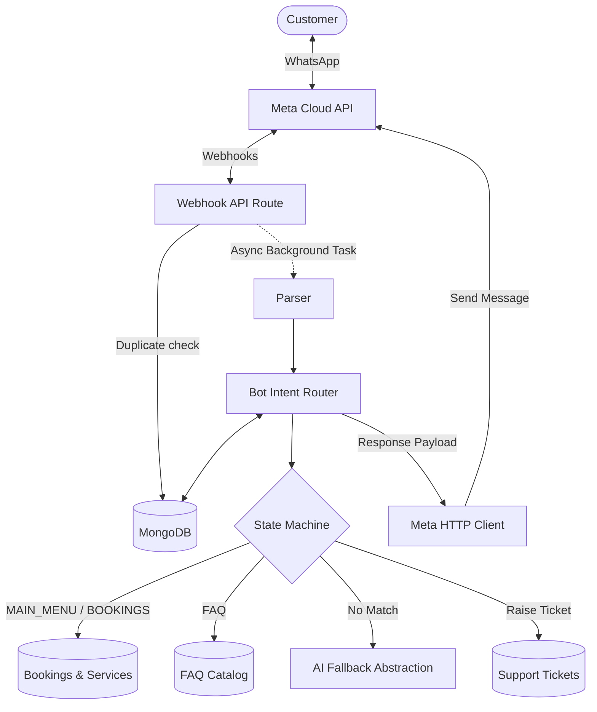

# WhatsApp Bot Architecture & Message Flow

This document describes the technical architecture, database schemas, state machine logic, and routing patterns of the Sparky WhatsApp Customer Support Bot.

---

## 1. System Architecture

The integration follows a decoupled, stateful architecture processing requests in the background to guarantee fast webhook acknowledgment.

---

## 2. Webhook Message Flow

1. **Webhook Reception**: Meta sends a POST request to `/api/whatsapp/webhook`.
2. **Parsing**: The incoming payload is normalized into a standard object by `whatsappParser.js`:
   `{ phone, messageId, messageType, text, buttonId, listId, contactName, timestamp }`
3. **De-duplication**: The webhook handler queries the `WhatsAppMessage` database for the given `messageId`. If it exists, processing terminates immediately, returning `200 OK`.
4. **Fast Acknowledge**: If new, the route spawns the bot process asynchronously in the background and immediately returns `200 OK` to Meta to prevent timeout retries.
5. **Customer & Conversation Resolution**: The bot normalizes the phone number (to 10 digits without country code) and retrieves or initializes `WhatsAppCustomer` and `WhatsAppConversation` documents.
6. **Commands Scan**: Before running state logic, it scans for global words: `hi`, `menu`, `restart`, `agent`, `human`.
7. **Execution**: The conversation state machine processes the input, generates a response, logs it, and dispatches it via Graph API.

---

## 3. Database Abstractions

Four new collections manage chatbot state:

### 1. `WhatsAppCustomer`
Tracks customer identity, bot toggles, and metadata.
- `phone`: Unique indexed string.
- `name`: User contact name.
- `customerId`: Ref to platform's core `Customer` model (resolves bookings).
- `botEnabled`: Toggle auto-replies.
- `humanHandoff`: Flag for agent takeover status.

### 2. `WhatsAppConversation`
Tracks active support dialogues and current states.
- `customer`: Ref `WhatsAppCustomer`.
- `status`: `OPEN`, `CLOSED`, `WAITING_FOR_CUSTOMER`, `WAITING_FOR_AGENT`.
- `mode`: `BOT`, `HUMAN`, `AI`.
- `currentState`: State enum (e.g. `MAIN_MENU`, `TRACK_BOOKING`, etc.).
- `metadata`: Mixed schema for saving user path context (like categoryId).

### 3. `WhatsAppMessage`
Full history of inbound/outbound exchanges.
- `conversation`: Ref `WhatsAppConversation`.
- `direction`: `INCOMING` or `OUTGOING`.
- `text`: Message body.
- `whatsappMessageId`: Unique sparse index for de-duplication.

### 4. `FAQ`
Repository-stored help questions.
- `question`, `answer`: Help details.
- `keywords`: Indexed strings for quick search matching.

---

## 4. Bot State Machine

The bot routes user replies depending on their active state:

| State | Input Action | Next State | Output Response |
| :--- | :--- | :--- | :--- |
| **MAIN_MENU** | Option selection (1-5) | `BOOKING_CATEGORY`, `TRACK_BOOKING`, `FAQ`, `SUPPORT` | Prompts specific input for that path |
| **BOOKING_CATEGORY** | Select category ID / name | `BOOKING_SERVICE` | Fetches active services in selected category |
| **BOOKING_SERVICE** | Select service ID / name | `MAIN_MENU` | Shows duration, cities, description, and link to book |
| **TRACK_BOOKING** | Input Booking Number | `MAIN_MENU` | Validates ownership and prints schedule/professional status |
| **FAQ** | Query question text | `MAIN_MENU` | Matches keywords in DB, falls back to AI, shows answer |
| **SUPPORT** | Click support issue type | `WAITING_FOR_TICKET_DESCRIPTION` | Prompts user to type description in one message |
| **WAITING_FOR_TICKET_DESCRIPTION**| User description text | `MAIN_MENU` | Raises a `SupportTicket` with SLA, prints Ticket ID |
| **HUMAN_HANDOFF** | Pauses chatbot | `MAIN_MENU` (on `restart`) | Notifies agent and halts auto-replies |

---

## 5. Security & Access Rules

1. **Booking Protection**: Customers are not allowed to view other customers' bookings. The bot validates that `booking.customerId` matches the linked `waCustomer.customerId`. If they do not match, it returns an authorization error.
2. **Administrative Access**: Admin APIs (`POST reply`, `PATCH conversations`) are protected by session authentication and check roles (`SUPER_ADMIN` or `CUSTOMER_SUPPORT`).
3. **No PII Logging**: Sensitive information, credentials, and access tokens are sanitized/redacted before server output.
4. **AI Safety**: The AI Fallback service is restricted from hallucinating prices, appointment slots, or booking details. It uses general text rules and prompts users to connect to support for sensitive actions.
